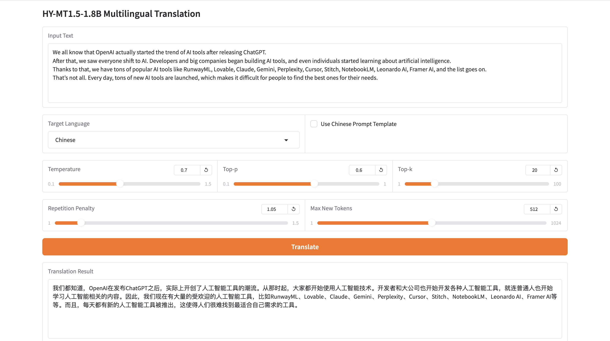
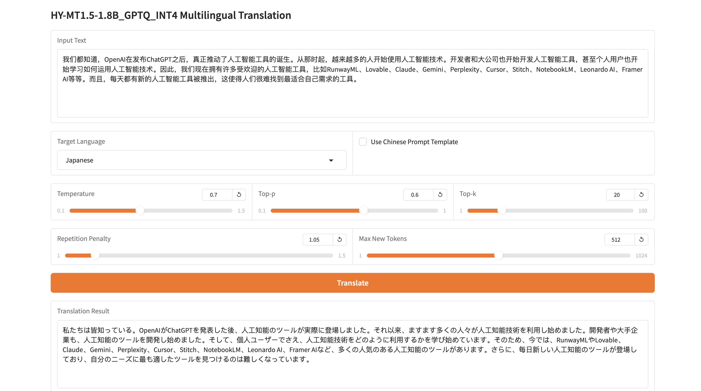

# HY-MT1.5-1.8B.axera

> HY-MT1.5-1.8B DEMO on Axera NPU.

- 目前支持 `Python` 语言, `C++` 代码正在开发中.
- 预编译模型可以从 [HuggingFace](https://huggingface.co/AXERA-TECH/HY-MT1.5-1.8B_GPTQ_INT4) 下载.
- 如需自行编译转换模型请参考 [模型转换](/model_convert/README.md) 章节内容.

## 支持平台

- [x] AX650N
- [x] AX630C

## Git Clone

首先使用如下命令 `clone` 本项目, 然后进入 `python` 文件夹:

```bash
$ git clone git@github.com:AXERA-TECH/HY-MT1.5-1.8B.axera.git
$ cd HY-MT1.5-1.8B.axera/python
```

之后在开发板上下载或安装以下支持库:

- 从 `huggingface` 下载 `HY-MT1.5-1.8B` 模型.

    ```bash
    $ git clone https://huggingface.co/tencent/HY-MT1.5-1.8B
    ```

- 在开发板上安装配置 `pyaxengine`, [点击跳转下载链接](https://github.com/AXERA-TECH/pyaxengine/releases). 注意板端 `SDK` 最低版本要求:

    - AX650 SDK >= 2.18
    - AX620E SDK >= 3.12
    - 执行 `pip3 install axengine-x.x.x-py3-none-any.whl` 安装

将下载后的预编译模型解压到当前文件夹[🔔可选], 默认文件夹排布如下:

```bash
$ tree -L 1
.
├── assets
├── config.json
├── gradio_demo.py
├── hymt1-5_1k_ax620e_axmodel
├── hymt1-5_2k_ax650n_axmodel
├── hymt1-5_tokenizer
├── infer_axmodel.py
├── infer_torch.py
├── README.md
└── utils

5 directories, 5 files
```

## 上板部署

- `AX650N` 的设备已预装 `Ubuntu 22.04`
- 以 `root` 权限登陆 `AX650N` 的板卡设备
- 接入互联网, 确保 `AX650N` 的设备能正常执行 `apt install`, `pip install` 等指令
- 已验证设备: `AX650N DEMO Board`、`爱芯派Pro(AX650N)`、`AX620E DEMO Board`

### Python API 运行

#### Requirements

```bash
$ mkdir /opt/site-packages
$ cd python
$ pip3 install -r requirements.txt --prefix=/opt/site-packages
``` 

#### 添加环境变量

如果遇到了无法找到 `python` 环境的问题, 那么可以尝试将以下两行命令添加到 `/root/.bashrc`(**实际添加的路径需要自行检查**)后, 重新连接终端或者执行 `source ~/.bashrc`.

```bash
$ export PYTHONPATH=$PYTHONPATH:/opt/site-packages/local/lib/python3.10/dist-packages  
$ export PATH=$PATH:/opt/site-packages/local/bin
``` 

#### 运行

使用 `Gradio API` 交互式翻译:

```bash
# 注意路径
$ python3 gradio_demo.py --hf_model HY-MT1.5-1.8B --axmodel_path HY-MT1.5-1.8B_GPTQ_INT4_ACC_axmodel
```

英文翻译为中文



中文翻译为日文



---

在 `Axera 开发板` 上运行以下命令开始语言翻译任务:

```sh
$ cd HY-MT1.5-1.8B.axera/python
$ python3 infer_axmodel.py --hf_model HY-MT1.5-1.8B/ --axmodel_path HY-MT1.5-1.8B_GPTQ_INT4_ACC_axmodel/ -q "It’s on the house."
```

输出结果如下:

```bash
Init InferenceSession: 100%|██████████████████████████████████████████████████████████| 32/32 [00:02<00:00, 14.55it/s]
[INFO] Using provider: AxEngineExecutionProvider
[INFO] Model type: 2 (triple core)
[INFO] Compiler version: 5.1-patch1-dirty 43f8606b-dirty
Model loaded successfully!
slice_indices: [0]
Slice prefill done: 0
answer >> 这是免费的。
```

#### 理论推理耗时统计 (AX650N)

该模型 prefill 阶段存在 9 个可用子图 (1k prefill + 1k decode), 共 32 层 Decode Layer, 每个子图耗时如下:

```sh
g1: 4.039 ms
g2: 4.263 ms
g3: 4.533 ms
g4: 4.909 ms
g5: 5.338 ms
g6: 5.527 ms
g7: 5.822 ms
g8: 6.126 ms
g9: 6.369 ms
```

decode 阶段只有一个子图, 耗时如下:

```sh
g0: 1.595 ms
```

后处理耗时: `12.665 ms`.

- 模型最大 TTFT 为: 46.926 * 32 + 12.665 约为 1514.3 ms.

- 模型解码速度为: 1000 / (1.595 * 32 + 12.665)  = 15.7 tokens/s.


#### 理论推理耗时统计 (AX620E)

该模型 prefill 阶段存在 5 个可用子图(512 prefill + 512 decode), 共 32 层 Decode Layer, 每个子图耗时如下:

```sh
g1: 49.556 ms
g2: 60.456 ms
g3: 71.635 ms
g4: 83.611 ms
g5: 94.068 ms
```

decode 阶段只有一个子图, 耗时如下:

```sh
g0: 6.443 ms
```

后处理耗时: `40.215 ms`.

- 模型最大 TTFT 为: 359.326 * 32 + 40.215 约为 11538.6 ms.

- 模型解码速度为: 1000 / (6.443 * 32 + 40.215)  = 4.05 tokens/s.


## 技术讨论

- Github issues
- QQ 群: 139953715
